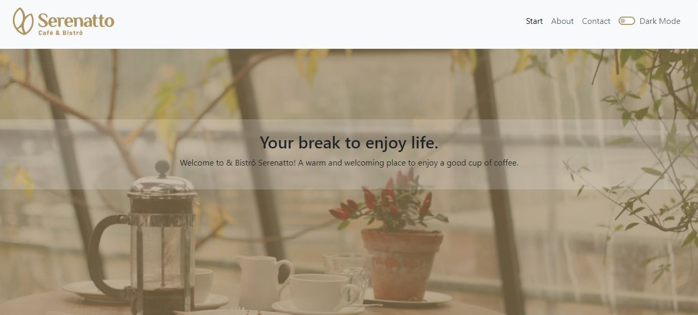

# Serenatto Cafe & Bistro - Landscaping Page

Welcome to Serenatto Cafe & Bistro - Landscaping Page! This project is a web page created using Figma, Bootstrap, HTML, CSS, and JavaScript. Additionally, it features support for the dark mode.

## Overview

Serenatto Cafe & Bistro is a landscaping page that combines functionality and design to showcase information about an imaginary cafe and bistro, with a focus on the surrounding landscape. With a modern and elegant design, this page is perfect for promoting a cozy and inviting atmosphere.

## Technologies Used

- **Bootstrap**: Used for responsive development and page layout.
- **HTML**: Employed for content structuring.
- **CSS**: Utilized for styling and appearance.
- **JavaScript**: Implemented for interactive functionality, including dark mode.
- **Figma**: Used for design and prototyping to create the project's visual elements.

## Features

- **Responsive Design**: The website is designed to adapt to different screen sizes, ensuring a consistent and user-friendly experience on various devices.

- **Navigation**: The navigation menu provides easy access to different sections of the website, including information about the cafe and bistro, services offered, product details, and a contact form.

- **Dark Mode**: Users have the option to switch between light and dark modes, enhancing the viewing experience and personalization.

- **Services**: The website highlights the cafe and bistro's services, including details about the cafe, bistro, delivery options, and even coworking facilities. Users can access additional information about each service through expandable sections.

- **Product Showcase**: The "Our Products" section showcases various cafe products, complete with images and descriptions. Users can click on these products to view additional details.

- **Contact Form**: The "Get in touch with us!" section features a contact form where users can submit their name, email, phone number, contact preferences, and feedback level. There's also an option to subscribe to news and promotions.

- **Social Media Links**: The footer includes links to the developer's social media profiles on [LinkedIn](https://www.linkedin.com/in/priscilla-riese/) and [GitHub](https://github.com/Priscillariese).

